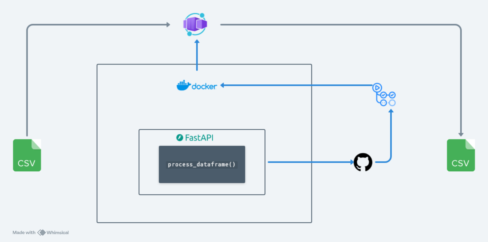

# CSV Transformation API



This project is a FastAPI-based web service that accepts a CSV file either as an upload or from a URL and returns a transformed CSV file as a downloadable response.

## Features

- Accepts CSV input via file upload or URL.
- Validates that input files are of the correct type (CSV).
- Processes the CSV content using a custom service (`process_csv`).
- Returns the processed CSV as a downloadable file.

## Endpoints

### `POST /transform`

**Description**: Accepts a CSV file or a file URL, processes it, and returns the transformed file.

- **Method**: `POST`
- **Path**: `/transform`
- **Response**: Transformed CSV file as a `StreamingResponse` with the header for file download.

**Request Parameters**:
- `file_url` (Optional): A URL pointing to a CSV file (as form data).
- `file` (Optional): A CSV file to upload (as form data).

**Requirements**:
- Either `file_url` or `file` must be provided. If both are missing, the endpoint returns a `400` error.

**Response**:
- A downloadable CSV file with the filename `transformed.csv`.

## Installation

1. **Clone the repository**:
   ```bash
   git clone https://github.com/yourusername/csv-transformation-api.git
   cd csv-transformation-api
   ```

2. **Create a virtual environment and activate it**:
   ```bash
   python3 -m venv env
   source env/bin/activate  # On Windows use `env\Scripts\activate`
   ```

3. **Install the dependencies**:
   ```bash
   pip install -r requirements.txt
   ```

4. **Run the application**:
   ```bash
   uvicorn app.main:app --reload
   ```

## Usage

- **API Endpoint**: `http://localhost:8000/transform`
- **Request Example** (using `curl`):
   ```bash
   curl -X 'POST' \
   'http://localhost:8000/transform' \
   -F 'file=@path/to/your-file.csv'
   -o path/to/your/output.csv
   ```

   **Or** for providing a file URL:
   ```bash
   curl -X 'POST' \
   'http://localhost:8000/transform' \
   -F 'file_url=https://example.com/your-file.csv'
   -o path/to/your/output.csv
   ```

## Project Structure

```
csv-transformation-api/
│
├── app/
│   ├── main.py            # Main entry point for the FastAPI app
│   ├── routes.py          # Defines the API routes
│   └── services/
│       └── transform_service.py  # Contains the `process_dataframe` function for processing logic
│
├── requirements.txt       # Project dependencies
└── README.md              # Project documentation
```

## Customization

- **`process_dataframe` function**: Customize the transformation logic by modifying `app/services/transform_service.py` to suit your needs.

## License

This project is licensed under the [MIT License](LICENSE).
